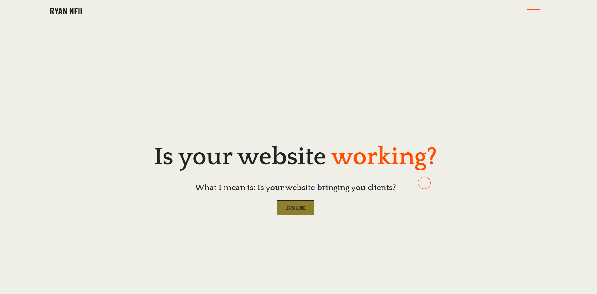

# Updated-Portfolio

## Description

This is an update to my initial portfolio. I am working transferring my previous portfolio into React.

## To Do List
1. Project Page
2. About Page
3. Service Page
4. Clean Up Home Page
5. Responsiveness

## Update as of 6/20/2021
1. Project Page[❌]
2. About Page[❌]
3. Service Page[❌]
4. Clean Up Home Page[❌]
5. Responsiveness[❌]

## Description of Updates

I started to build out the components for the home page. I styled the landing page and button similar to previous portfolio.

## Tools Used
Styled Components
Framer Motion - Planning to Use
## Access

https://github.com/vegaryanneil/Updated-Portfolio

https://vegaryanneil.github.io/Updated-Portfolio/

## Resources

Dev Ed

https://www.youtube.com/watch?v=H4MkGzoACpQ

https://www.youtube.com/watch?v=TpwpAYi-p2w